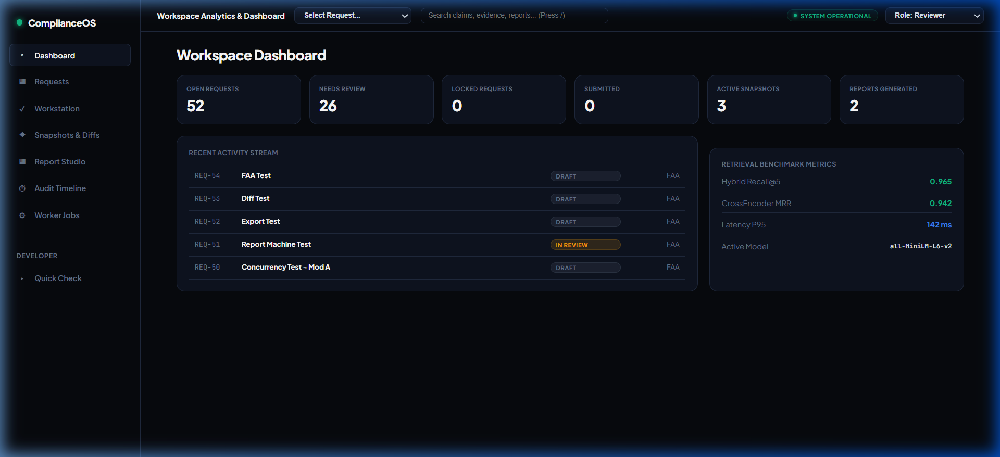
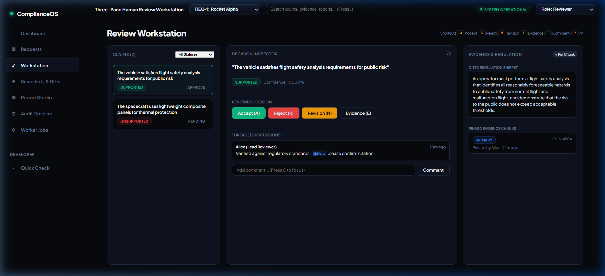
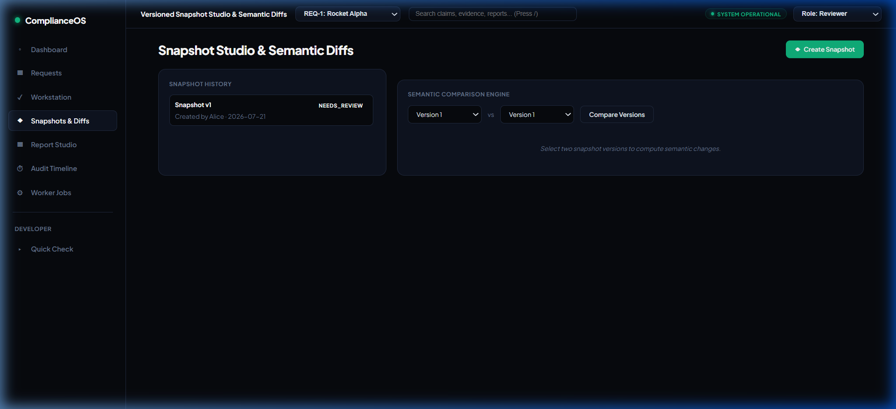
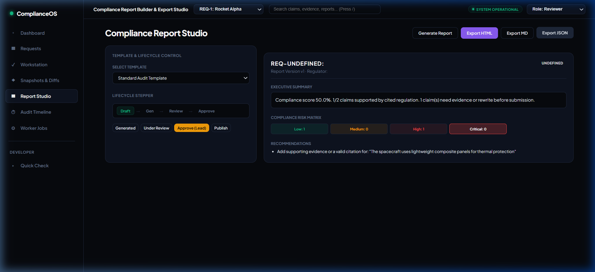

# ComplianceOS — Enterprise AI Regulatory Compliance Platform


**ComplianceOS** is an enterprise-grade, human-in-the-loop AI compliance verification platform. It automates complex regulatory claim verification against engineering standards (FAA Part 450, NRC 10 CFR, ASME BPVC) while maintaining a strict audit trail, versioned review snapshots, structured report generation, and operational production hardening.

---

## Key Features

- 🎯 **Automated Claim Verification**: Parses engineering specs and matches compliance claims against regulatory corpora using hybrid dense-lexical vector search.
- 🖥️ **3-Pane Review Workstation**: Interactive human workstation for reviewing claim evidence, accepting/rejecting decisions, pinning evidence, and adding threaded comments.
- ⚡ **Asynchronous Background Workers**: Outbox event dispatching for heavy document parsing, vector embedding generation, and report compilation.
- 📜 **Compliance Report Studio**: Automated PDF/HTML/Markdown report compilation with risk matrices, version lineage, and semantic snapshot diffs.
- 🛡️ **Production Hardened**: Pluggable auth (API Key / JWT), request tracing (`X-Request-ID`), liveness/readiness probes (`/healthz`, `/readyz`), and Prometheus metrics (`/metrics`).


---

## Application Walkthrough

| **Dashboard View (Demo Dataset Metrics)** | **3-Pane Review Workstation** |
| :---: | :---: |
|  |  |

| **Snapshots & Semantic Diffs** | **Report Studio & Exporters** |
| :---: | :---: |
|  |  |

*\*Metrics displayed on the dashboard above represent synthetic demo benchmark results.*

---

## High-Level System Architecture

```
                                  ┌────────────────────────┐
                                  │   Review Workstation   │
                                  │      (index.html)      │
                                  └───────────┬────────────┘
                                              │ HTTP / JSON
                                              ▼
┌───────────────────────────────────────────────────────────────────────────────────────────┐
│                                   FastAPI Web Platform                                    │
│   (X-Request-ID Tracing • RBAC Auth • Security Headers • Rate Limiter • JSON Logging)      │
└────────┬─────────────────────────────┬────────────────────────────┬───────────────────────┘
         │                             │                            │
         ▼                             ▼                            ▼
┌─────────────────┐           ┌─────────────────┐          ┌─────────────────┐
│ Review Domain   │           │ Report Domain   │          │ Retrieval Core  │
│ • State Machine │           │ • Snapshots     │          │ • SentenceTrans │
│ • Snapshots     │           │ • Risk Matrix   │          │ • Overlap Plan  │
│ • Comments/Pins │           │ • Exporters     │          │ • Receipts      │
└────────┬────────┘           └────────┬────────┘          └────────┬────────┘
         │                             │                            │
         └──────────────────────┬──────┴────────────────────────────┘
                                │
                                ▼
 ┌──────────────────────────────────────────────────────────────┐
 │                    Persistence & Workers                     │
 │   • PostgreSQL / SQLite (Async SQLAlchemy + Alembic)         │
 │   • Qdrant Vector DB (Dense + Sparse Hybrid Index)           │
 │   • Async Background Worker Queue (Outbox Dispatcher)        │
 └──────────────────────────────────────────────────────────────┘
```

---

## Quick Start & Deployment

### Option 1: Local Development

```bash
# Clone repository & setup virtual environment
git clone https://github.com/rajveer100704/ComplianceOS.git
cd ComplianceOS
python -m venv venv
source venv/bin/activate  # On Windows: .\venv\Scripts\Activate.ps1

# Install dependencies
pip install -r requirements.txt

# Run database migrations & start application server
python -m alembic upgrade head
python main.py
```
Access the application workspace UI at `http://localhost:8000`.

### Option 2: Containerized Docker Composition

Launch the full production container stack (FastAPI, Async Worker, Qdrant Vector Engine, PostgreSQL):

```bash
cp .env.example .env
docker compose up --build -d
```

---

## Technology Stack

| Layer | Technology | Description |
| :--- | :--- | :--- |
| **Backend Framework** | FastAPI (Python 3.11+) | Async REST API server with request tracing & OpenAPI specs |
| **ORM & Database** | SQLAlchemy (Async) + Alembic | Async Unit of Work pattern supporting PostgreSQL and SQLite |
| **Vector Engine** | Qdrant (v1.7.4) | Dense + Lexical hybrid vector storage and similarity search |
| **Embeddings & ML** | SentenceTransformers (`all-MiniLM-L6-v2`) | Local dense vector embedding generation and caching |
| **Worker Queue** | Python Async Background Worker | Outbox pattern event dispatching and document export runner |
| **Security & Auth** | Pluggable (API Key / JWT) | RBAC guards (`Reviewer`, `Lead Reviewer`, `Admin`) & Security Headers |
| **Frontend UI** | Vanilla HTML5 / CSS3 / JS | 3-pane workstation, keyboard shortcuts (`A`,`R`,`N`,`E`,`C`,`P`), live report preview |
| **Containerization** | Docker & Docker Compose | Multi-stage Docker image with healthchecks & named volumes |

---

## Primary API Endpoint Summary

| Endpoint | Method | Purpose | RBAC Role |
| :--- | :--- | :--- | :--- |
| `/healthz` | `GET` | Lightweight liveness probe (HTTP 200) | Public |
| `/readyz` | `GET` | Dependency readiness probe (DB, Qdrant, Workers, Models) | Public |
| `/metrics` | `GET` | Prometheus-compatible operational text metrics | Public |
| `/api/requests` | `GET / POST` | List or create compliance requests | Reviewer |
| `/api/claims/{id}/review` | `POST` | Record reviewer claim decisions (`Accept`, `Reject`, `Revision`) | Reviewer |
| `/api/requests/{id}/snapshots` | `GET / POST` | Capture versioned review snapshots | Lead Reviewer |
| `/api/requests/{id}/reports` | `POST` | Generate structured compliance report | Reviewer |
| `/api/reports/{id}/transition` | `POST` | Report lifecycle stepper (`Draft -> Approved -> Published`) | Lead Reviewer / Admin |
| `/api/reports/{id}/export` | `POST` | Enqueue background document export (HTML, MD, JSON) | Lead Reviewer / Admin |

---

## Documentation & Project Reference

- 📖 **[Deployment Guide](docs/deployment-guide.md)** — Cloud topology, environment variables, CI/CD pipeline & smoke tests.
- 📋 **[Operational Validation Runbook](docs/runtime-validation.md)** — Live deployment execution log template & test dataset.
- 🏛️ **[Architecture Decision Records (ADRs)](docs/adr/)** — Technical trade-off rationale for Qdrant, FastAPI, PostgreSQL, and Outbox Workers.
- 🤝 **[Contributing Guidelines](CONTRIBUTING.md)** — Development setup, formatting, and PR rules.
- 🛡️ **[Security Policy](SECURITY.md)** — Vulnerability reporting guidelines and GitHub security advisories.
- 🗺️ **[Platform Roadmap](ROADMAP.md)** — Architecture milestones and future enterprise features.

---

## Platform Evolution

| Phase | Subsystem | Key Accomplishments | Status |
| :--- | :--- | :--- | :--- |
| **Phase 1** | **Retrieval Framework** | Lexical/Dense indexing, threshold planners, verification receipts | ✅ Complete |
| **Phase 2** | **Persistence Platform** | Async SQLAlchemy models, Alembic migrations, Unit of Work pattern | ✅ Complete |
| **Phase 3** | **Background Workers** | Outbox pattern, async task queue, execution receipts | ✅ Complete |
| **Phase 4** | **Production Retrieval** | `all-MiniLM-L6-v2` embeddings, Qdrant vector database, hybrid search | ✅ Complete |
| **Phase 5** | **Optimization Platform** | Multi-threaded indexing, embedding cache, benchmark evaluator | ✅ Complete |
| **Phase 6** | **Review & Collaboration** | Formal state machine (`Draft -> Approved`), evidence pinning, comments | ✅ Complete |
| **Phase 7** | **Compliance Reporting** | Structured report sections, risk matrix, version lineage, semantic diffs | ✅ Complete |
| **Phase 8** | **Unified Workspace UI** | 3-pane review workstation, keyboard shortcuts, live report studio | ✅ Complete |
| **Phase 9** | **Production Hardening** | Pluggable auth, `X-Request-ID` tracing, `/healthz`/`/readyz`/`/metrics`, Docker Compose | ✅ Complete |

---

## License

Copyright © 2026 Rajveer Singh Saggu. Distributed under the [MIT License](LICENSE).
