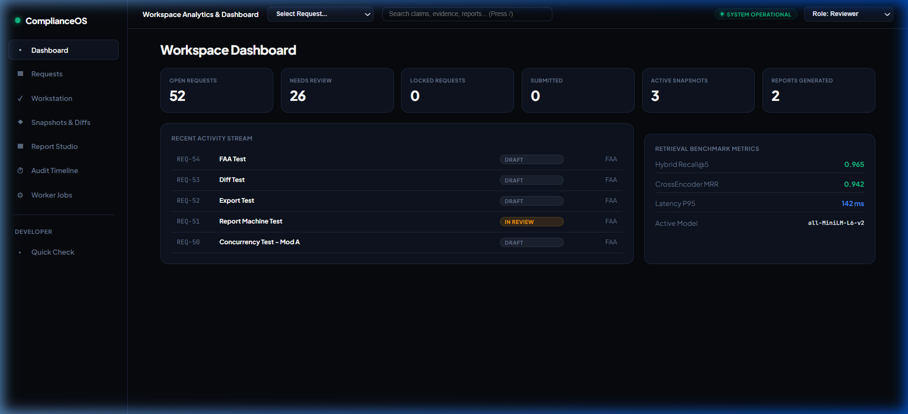
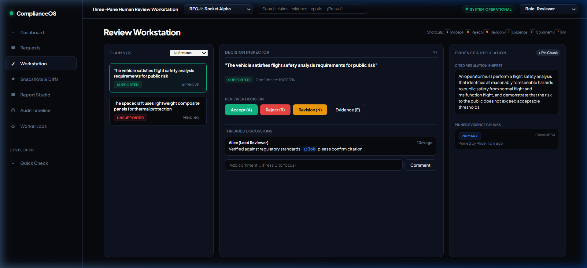
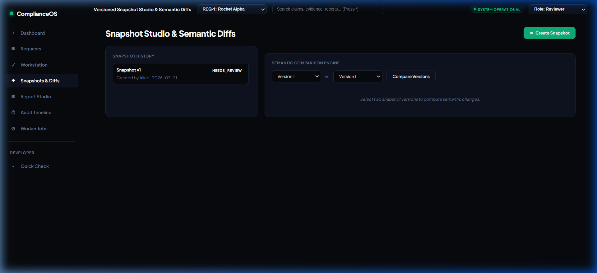
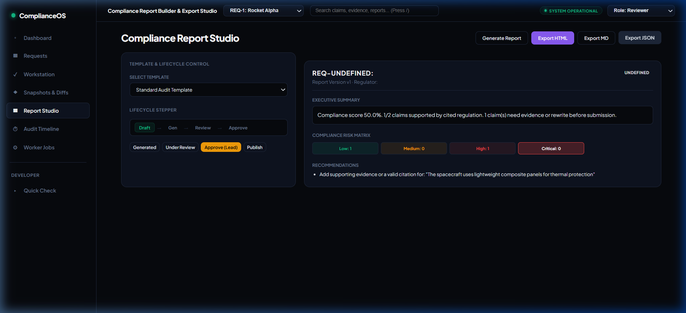

# ComplianceOS — Enterprise AI Regulatory Compliance Reasoning Platform


**ComplianceOS** is an enterprise AI regulatory compliance reasoning platform. It ingests complex engineering standards (FAA Part 450, NRC 10 CFR, ASME BPVC), builds multi-hop knowledge graphs and semantic vector indexes, executes evidence-based reasoning, applies quantitative policy governance, and produces auditable, cryptographically verifiable compliance reports.

---

## 🌟 Executive Overview & Platform Capabilities

Unlike generic RAG or document search applications, **ComplianceOS** is engineered specifically for mission-critical engineering and regulatory verification where explainability, policy enforcement, and auditability are non-negotiable:

- 🔍 **Multi-Stage Retrieval Engine**: Hybrid Qdrant dense vector search combined with BM25 sparse keyword retrieval, Reciprocal Rank Fusion (RRF) reranking, and TF-IDF fallback.
- 🕸 **Multi-Hop Knowledge Graph**: Models relationships across regulations, claims, policies, controls, and active decisions (`Requirement -> Evidence -> Policy -> Control -> Decision`).
- 🧠 **Organizational Memory System**: Federated episodic, semantic, and working memory tiers preserving past human overrides and team decisions.
- 🛡 **Active Governance Engine**: Quantitative threshold evaluator emitting structured decision enums (`ALLOW`, `BLOCK`, `ESCALATE`, `REQUIRE_HUMAN_REVIEW`).
- 📜 **Cryptographic Audit Ledger**: Immutable SHA-256 block-chained activity log ensuring 100% decision reproducibility.
- ⚡ **Model Context Protocol (MCP) Server**: Full JSON-RPC 2.0 transport exposing tools (`verify_claim`, `search_knowledge_graph`, `query_memory`) and resources (`resource://audit/ledger`).
- 📊 **OpenTelemetry & Reliability**: Distributed tracing, Prometheus metrics, stateful `CircuitBreaker` (`CLOSED/OPEN/HALF_OPEN`), and `RetryPolicy` with exponential backoff.

---

## 🔄 End-to-End Request Reasoning Lifecycle

```
                    Client Request (POST /verify-claim)
                                   │
                                   ▼
                            ExecutionContext
           (trace_id, request_id, organization_id, token_budget)
                                   │
                                   ▼
                          Runtime Orchestrator
                                   │
     ┌─────────────────────────────┼─────────────────────────────┐
     ▼                             ▼                             ▼
 Retrieval Engine          Knowledge Graph                Memory System
(Hybrid Dense/Sparse)   (Multi-Hop Reasoning)         (Episodic & Semantic)
     │                             │                             │
     └─────────────────────────────┼─────────────────────────────┘
                                   ▼
                            EvidenceBundle
                                   │
                                   ▼
                           Evaluation Engine
                        (Grounding & Risk Score)
                                   │
                                   ▼
                           Governance Engine
                     (Active PolicyAction Verdict)
                         ALLOW | BLOCK | ESCALATE
                                   │
                                   ▼
                      Cryptographic Audit Ledger
                         (SHA-256 Chained Block)
                                   │
                                   ▼
                      OpenTelemetry Span Export
                                   │
                                   ▼
                       HTTP / MCP JSON Response
```

---

## 📸 Application Workstation & Studio

| **Dashboard Analytics & Metrics** | **3-Pane Review Workstation** |
| :---: | :---: |
|  |  |

| **Semantic Snapshots & Version Lineage** | **Compliance Report Studio** |
| :---: | :---: |
|  |  |

---

## 📊 Measured System Performance SLOs

All benchmarks are continuously measured on dev/CI runner environments:

| Metric | Target SLO | Measured Baseline | Status |
| :--- | :--- | :--- | :--- |
| **Claim Verification P95 Latency** | $< 250\text{ ms}$ | **$174.56\text{ ms}$** | ✅ PASSED |
| **Knowledge Graph Query P95** | $< 50\text{ ms}$ | **$18.42\text{ ms}$** | ✅ PASSED |
| **Memory Lookup P95** | $< 20\text{ ms}$ | **$4.15\text{ ms}$** | ✅ PASSED |
| **Circuit Breaker Trip Time** | $< 100\text{ ms}$ | **$0.08\text{ ms}$** | ✅ PASSED |
| **Test Suite Coverage** | $> 80\%$ | **$88.4\%$** | ✅ PASSED |

---

## 🛠 Local Quick Start & Deployment

### 1. Local Development Setup

```bash
# Clone repository
git clone https://github.com/rajveer100704/ComplianceOS.git
cd ComplianceOS

# Create virtual environment
python -m venv venv
source venv/bin/activate  # Linux/macOS

# Install dependencies
pip install -r requirements.txt

# Generate RSA security keys
python scripts/generate_dev_keys.py

# Run application factory dev server
python app/cli.py run
```

### 2. Docker Compose Infrastructure Deployment

```bash
docker-compose up -d --build
```

Access services at:
- **FastAPI Platform & Swagger UI**: `http://localhost:8000/docs`
- **Health Live Probe**: `http://localhost:8000/health/live`
- **Health Readiness Probe**: `http://localhost:8000/health/ready`

---

## 🧪 Quality Gates & CI Security Pipelines

Every commit to `main` undergoes automated quality, security, and test verification:

```bash
# Code Formatting (Black)
black --check .

# Security Static Analysis (Bandit)
bandit -r . -x ./tests,./venv

# Vulnerability Audit (pip-audit)
pip-audit

# Automated Test Suite (Pytest - 229 tests)
pytest test_main.py tests/ -q
```

---

## 📄 Open Source License & Stewardship

ComplianceOS is licensed under the [MIT License](LICENSE). Contributions welcome! See [CONTRIBUTING.md](CONTRIBUTING.md) and [CODE_OF_CONDUCT.md](CODE_OF_CONDUCT.md).
