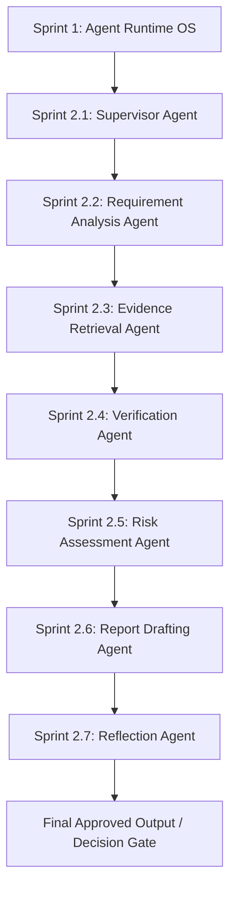

# Sprint 2 Multi-Agent System — Platform Architecture & Data Flow

> **Version**: 2.0.0  
> **Status**: Completed  
> **Target Release**: v2.0-alpha

---

## 1. System Overview

The **Sprint 2 Multi-Agent System** transforms unstructured regulatory documentation into audit-ready compliance verification reports through a 6-stage sequential reasoning pipeline governed by the **Supervisor Agent** and executed over the **Agent Runtime OS**.



---

## 2. Agent Responsibilities & Data Contracts

| Agent | Input Artifacts | Output State Fields | Key Subsystems / Libraries |
| :--- | :--- | :--- | :--- |
| **Supervisor Agent** (`agents/supervisor.py`) | User Prompt, Execution Plan | `steps`, `checkpoint_id`, `current_step` | ExecutionCoordinator, StateGraph |
| **Requirement Analysis Agent** (`agents/requirement_analysis.py`) | Raw Document Text | `requirements` | `document_processing/` (Parser, Layout, Extractor) |
| **Evidence Retrieval Agent** (`agents/evidence_retrieval.py`) | `requirements` | `evidence`, `retrieved_documents` | `retrieval/` (HybridRetriever, CrossEncoder) |
| **Verification Agent** (`agents/verification.py`) | `evidence`, `requirements` | `claims`, `policy_results` | `verification/` (GroundingEngine, CitationResolver) |
| **Risk Assessment Agent** (`agents/risk_assessment.py`) | `claims`, `policy_results` | `risk_assessment`, `metadata.risk_matrix` | `risk/` (5x5 Matrix, MultiDimensionalScorer) |
| **Report Drafting Agent** (`agents/report_drafting.py`) | `requirements`, `claims`, `risk_assessment` | `report`, `report_sections`, `report_trace` | `reporting_ai/` (ReportPlanner, SectionGenerators) |
| **Reflection Agent** (`agents/reflection.py`) | Full `AgentRuntimeState` | `reflection`, `reflection_trace`, `approval_ready` | `reflection/` (Consistency, Citation, Confidence) |

---

## 3. Data Flow & Frozen State Contracts

The shared `AgentRuntimeState` acts as the single source of truth across all 6 agents:

```
AgentRuntimeState
├── run_id: str
├── organization_id: str
├── requirements: List[Requirement]
├── retrieved_documents: List[Chunk]
├── evidence: List[EvidenceBundle]
├── claims: List[VerificationResult]
├── policy_results: List[PolicyDecision]
├── risk_assessment: RiskResult
├── report: StructuredReport
├── report_sections: List[ReportSection]
├── reflection: ReflectionResult
└── approval_ready: bool
```

---

## 4. Decision Gate Matrix

When the **Reflection Agent** evaluates the completed execution graph, it outputs one of three terminal decisions:

1. `APPROVED`: Confidence $\ge 0.85$, zero missing citations, clean consistency. Sets `state.approval_ready = True`.
2. `REQUIRES_REVIEW`: Grounding score $\ge 0.60$ with advisory warnings. Escalates to human reviewer workstation.
3. `REQUIRES_RERUN`: Confidence $< 0.60$. Triggers upstream re-execution of `EvidenceRetrievalAgent` with expanded search bounds.
