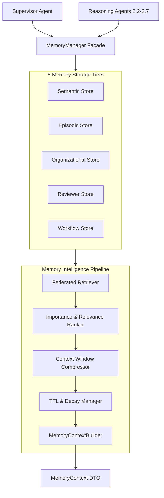

# Shared Memory Engine — System Architecture

```mermaid
graph TD
    Supervisor[Supervisor Agent] --> MemoryManager[MemoryManager Facade]
    Agents[Reasoning Agents 2.2-2.7] --> MemoryManager

    subgraph StorageTiers [5 Memory Storage Tiers]
        SemanticStore[Semantic Store]
        EpisodicStore[Episodic Store]
        OrgStore[Organizational Store]
        ReviewerStore[Reviewer Store]
        WorkflowStore[Workflow Store]
    end

    MemoryManager --> StorageTiers

    subgraph IntelligencePipeline [Memory Intelligence Pipeline]
        Retriever[Federated Retriever] --> Ranker[Importance & Relevance Ranker]
        Ranker --> Compressor[Context Window Compressor]
        Compressor --> Expiration[TTL & Decay Manager]
        Expiration --> Builder[MemoryContextBuilder]
    end

    StorageTiers --> IntelligencePipeline
    Builder --> UnifiedContext[MemoryContext DTO]
```
