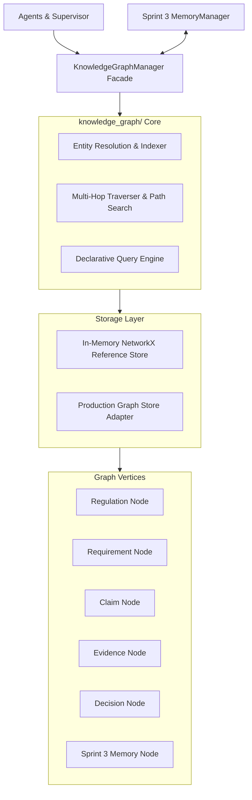
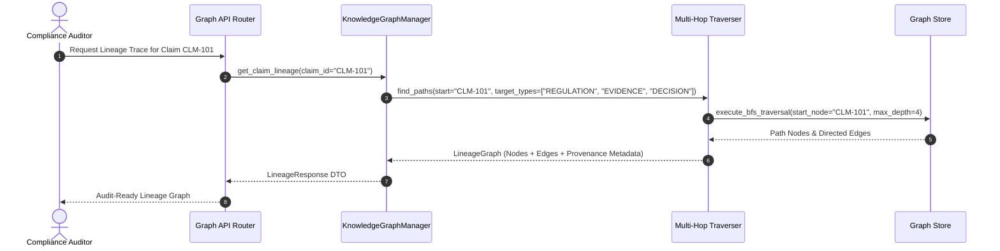

# Regulatory Knowledge Graph Engine — Architecture Blueprint

```mermaid
graph TD
    Agents[Agents & Supervisor] --> GraphManager[KnowledgeGraphManager Facade]
    MemorySubsystem[Sprint 3 MemoryManager] <--> GraphManager

    subgraph GraphEngine [knowledge_graph/ Core]
        Indexer[Entity Resolution & Indexer]
        Traverser[Multi-Hop Traverser & Path Search]
        QueryBuilder[Declarative Query Engine]
    end

    GraphManager --> GraphEngine

    subgraph GraphStorage [Storage Layer]
        InMemoryGraph[In-Memory NetworkX Reference Store]
        PersistentGraph[Production Graph Store Adapter]
    end

    GraphEngine --> GraphStorage

    subgraph NodeTopology [Graph Vertices]
        REG[Regulation Node]
        REQ[Requirement Node]
        CLM[Claim Node]
        EVI[Evidence Node]
        DEC[Decision Node]
        MEM[Sprint 3 Memory Node]
    end

    GraphStorage --> NodeTopology
```

---

## Multi-Hop Lineage Query Flow

```mermaid
sequenceDiagram
    autonumber
    actor Auditor as Compliance Auditor
    participant API as Graph API Router
    participant Mgr as KnowledgeGraphManager
    participant Trav as Multi-Hop Traverser
    participant Store as Graph Store

    Auditor->>API: Request Lineage Trace for Claim CLM-101
    API->>Mgr: get_claim_lineage(claim_id="CLM-101")
    Mgr->>Trav: find_paths(start="CLM-101", target_types=["REGULATION", "EVIDENCE", "DECISION"])
    Trav->>Store: execute_bfs_traversal(start_node="CLM-101", max_depth=4)
    Store-->>Trav: Path Nodes & Directed Edges
    Trav-->>Mgr: LineageGraph (Nodes + Edges + Provenance Metadata)
    Mgr-->>API: LineageResponse DTO
    API-->>Auditor: Audit-Ready Lineage Graph
```
