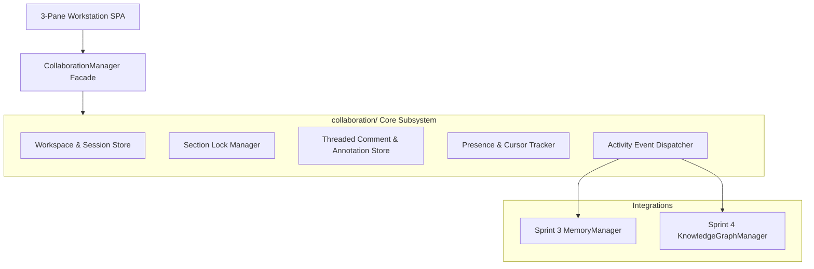
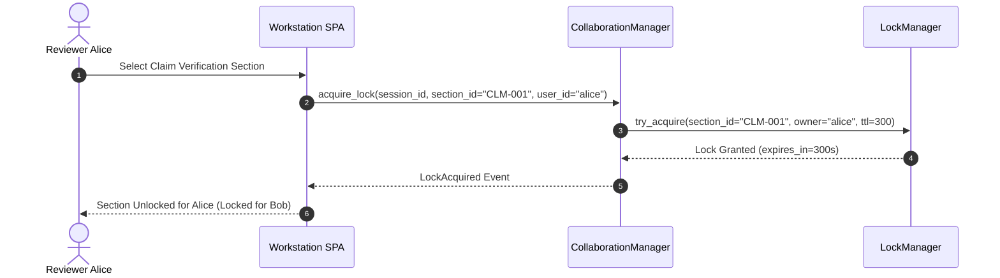

# Real-Time Collaboration & Workspace Workstation — Architecture Blueprint

```mermaid
graph TD
    SPA[3-Pane Workstation SPA] --> CollabManager[CollaborationManager Facade]

    subgraph CollabEngine [collaboration/ Core Subsystem]
        WorkspaceStore[Workspace & Session Store]
        LockManager[Section Lock Manager]
        CommentStore[Threaded Comment & Annotation Store]
        PresenceTracker[Presence & Cursor Tracker]
        ActivityDispatcher[Activity Event Dispatcher]
    end

    CollabManager --> CollabEngine

    subgraph PlatformIntegration [Integrations]
        MemorySubsystem[Sprint 3 MemoryManager]
        GraphEngine[Sprint 4 KnowledgeGraphManager]
    end

    ActivityDispatcher --> MemorySubsystem
    ActivityDispatcher --> GraphEngine
```

---

## Concurrency Section Lock Acquisition Flow

```mermaid
sequenceDiagram
    autonumber
    actor UserA as Reviewer Alice
    participant SPA as Workstation SPA
    participant Mgr as CollaborationManager
    participant Lock as LockManager

    UserA->>SPA: Select Claim Verification Section
    SPA->>Mgr: acquire_lock(session_id, section_id="CLM-001", user_id="alice")
    Mgr->>Lock: try_acquire(section_id="CLM-001", owner="alice", ttl=300)
    Lock-->>Mgr: Lock Granted (expires_in=300s)
    Mgr-->>SPA: LockAcquired Event
    SPA-->>UserA: Section Unlocked for Alice (Locked for Bob)
```
