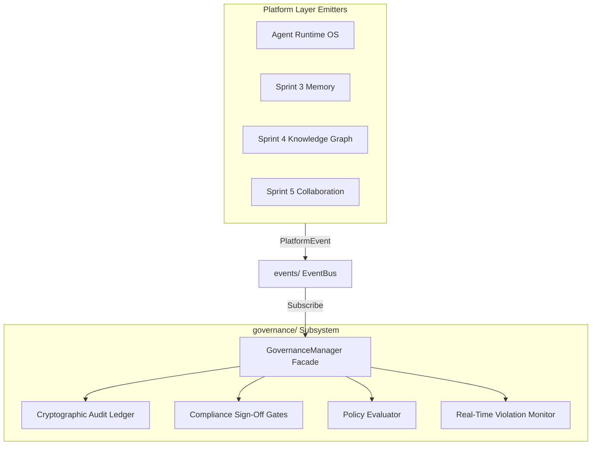
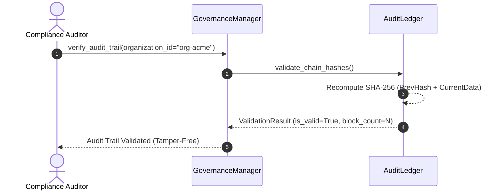

# AI Governance & Audit Engine — Architecture Blueprint

```mermaid
graph TD
    subgraph Emitters [Platform Layer Emitters]
        AgentRuntime[Agent Runtime OS]
        Memory[Sprint 3 Memory]
        Graph[Sprint 4 Knowledge Graph]
        Collab[Sprint 5 Collaboration]
    end

    Emitters -->|PlatformEvent| EventBus[events/ EventBus]

    EventBus -->|Subscribe| GovManager[GovernanceManager Facade]

    subgraph GovernanceEngine [governance/ Subsystem]
        GovManager --> AuditLedger[Cryptographic Audit Ledger]
        GovManager --> ComplianceGates[Compliance Sign-Off Gates]
        GovManager --> PolicyEvaluator[Policy Evaluator]
        GovManager --> ViolationMonitor[Real-Time Violation Monitor]
    end
```

---

## Cryptographic Ledger Verification Sequence

```mermaid
sequenceDiagram
    autonumber
    actor Auditor as Compliance Auditor
    participant Mgr as GovernanceManager
    participant Ledger as AuditLedger

    Auditor->>Mgr: verify_audit_trail(organization_id="org-acme")
    Mgr->>Ledger: validate_chain_hashes()
    Ledger-->>Ledger: Recompute SHA-256 (PrevHash + CurrentData)
    Ledger-->>Mgr: ValidationResult (is_valid=True, block_count=N)
    Mgr-->>Auditor: Audit Trail Validated (Tamper-Free)
```
