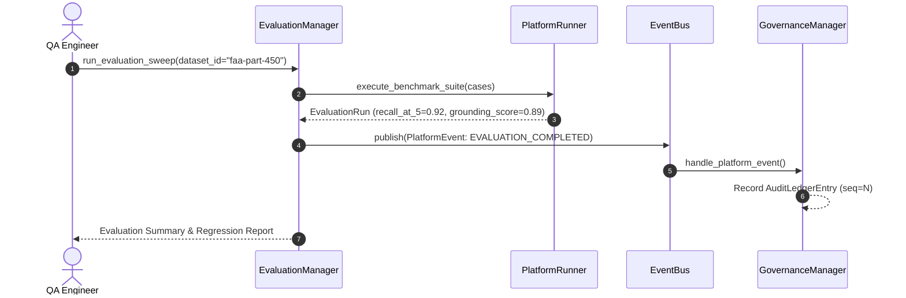

# Benchmark Suite & Evaluation Engine — Architecture Blueprint

```mermaid
graph TD
    EvalManager[EvaluationManager Facade] --> BenchmarkLoader[Benchmark Dataset Loader]
    EvalManager --> PlatformRunner[Platform Pipeline Runner]

    subgraph EvaluationEngine [evaluation/ Subsystem]
        PlatformRunner --> MetricEngine[Metric Evaluators]
        MetricEngine --> RecallEvaluator[Recall@K & MRR]
        MetricEngine --> GroundingEvaluator[Grounding & Hallucination Risk]
        MetricEngine --> LatencyEvaluator[Latency Telemetry]
    end

    EvalManager -->|PlatformEvent| EventBus[events/ EventBus]
    EventBus -->|Subscribe| GovManager[Sprint 6 GovernanceManager]
```

---

## Evaluation Sweep Sequence Flow


