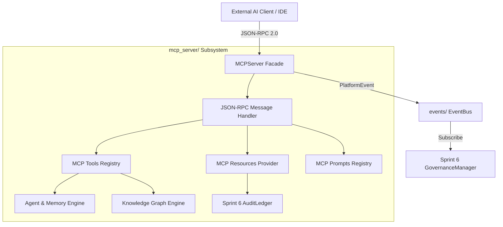
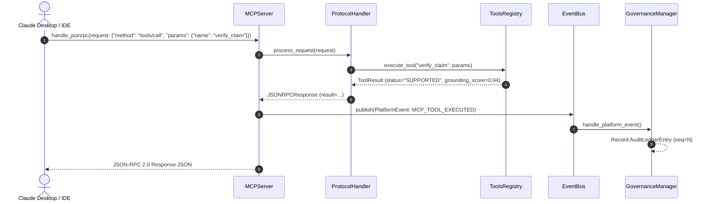

# Model Context Protocol (MCP) Ecosystem — Architecture Blueprint

```mermaid
graph TD
    Client[External AI Client / IDE] -->|JSON-RPC 2.0| MCPServer[MCPServer Facade]

    subgraph MCPEcosystem [mcp_server/ Subsystem]
        MCPServer --> ProtocolHandler[JSON-RPC Message Handler]
        ProtocolHandler --> ToolsRegistry[MCP Tools Registry]
        ProtocolHandler --> ResourcesProvider[MCP Resources Provider]
        ProtocolHandler --> PromptsRegistry[MCP Prompts Registry]

        ToolsRegistry --> AgentPipeline[Agent & Memory Engine]
        ToolsRegistry --> KnowledgeGraph[Knowledge Graph Engine]
        ResourcesProvider --> AuditLedger[Sprint 6 AuditLedger]
    end

    MCPServer -->|PlatformEvent| EventBus[events/ EventBus]
    EventBus -->|Subscribe| GovManager[Sprint 6 GovernanceManager]
```

---

## MCP JSON-RPC Message Sequence Flow

```mermaid
sequenceDiagram
    autonumber
    actor Client as Claude Desktop / IDE
    participant Svr as MCPServer
    participant Proto as ProtocolHandler
    participant Tools as ToolsRegistry
    participant Bus as EventBus
    participant Gov as GovernanceManager

    Client->>Svr: handle_jsonrpc(request: {"method": "tools/call", "params": {"name": "verify_claim"}})
    Svr->>Proto: process_request(request)
    Proto->>Tools: execute_tool("verify_claim", params)
    Tools-->>Proto: ToolResult (status="SUPPORTED", grounding_score=0.94)
    Proto-->>Svr: JSONRPCResponse (result=...)
    Svr->>Bus: publish(PlatformEvent: MCP_TOOL_EXECUTED)
    Bus->>Gov: handle_platform_event()
    Gov-->>Gov: Record AuditLedgerEntry (seq=N)
    Svr-->>Client: JSON-RPC 2.0 Response JSON
```
